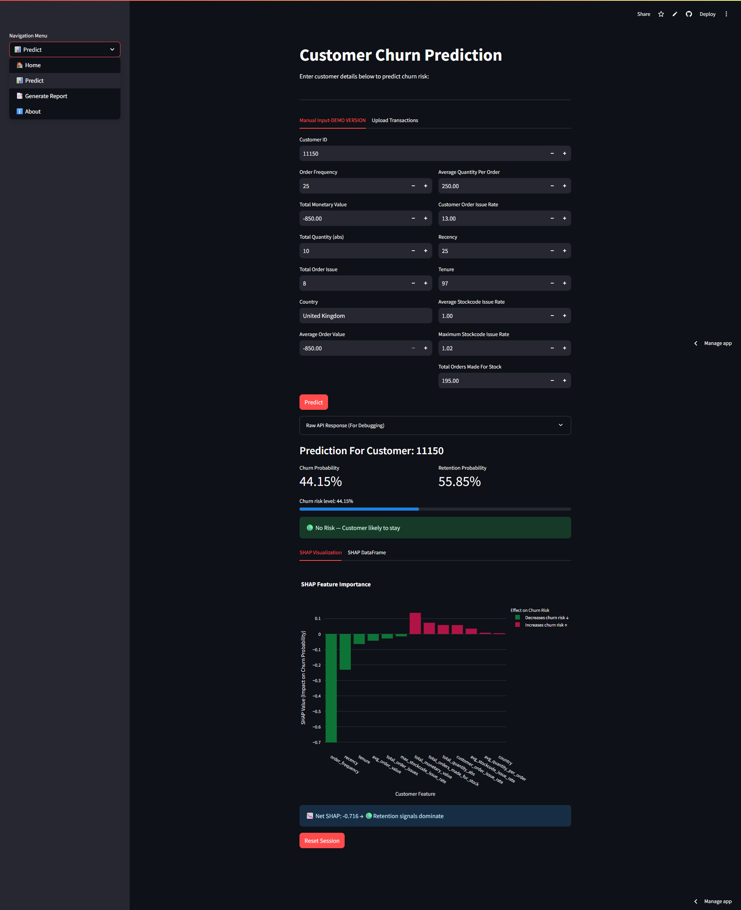
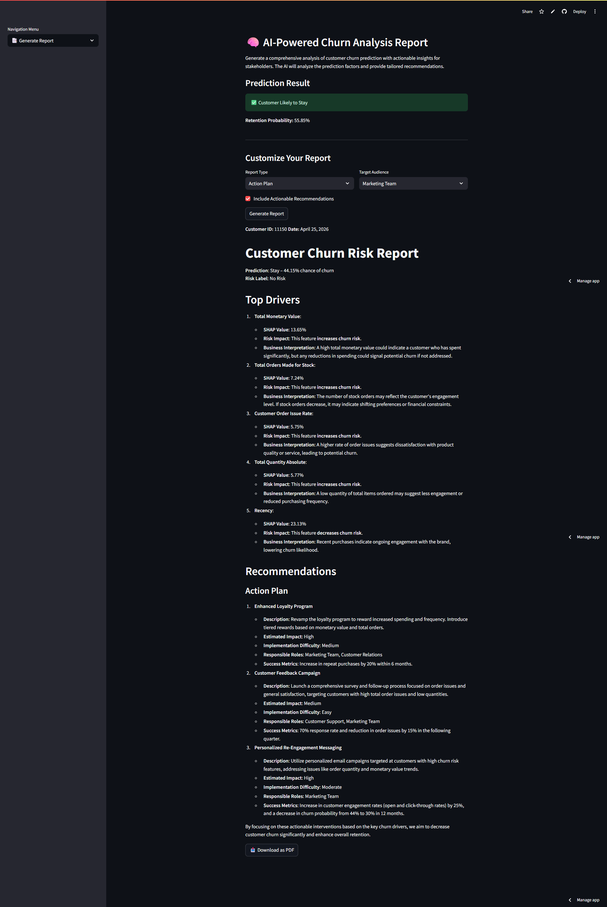

# 🛒 Customer Churn Prediction System
### End-to-end production ML pipeline with SHAP explanations and AI-generated reports
[](https://e2e-customer-churn-ai.streamlit.app/) 

[](https://an-end-to-end-customer-churn-prediction.onrender.com/health) 
[](https://archive.ics.uci.edu/dataset/502/online+retail+ii)

[](https://hub.docker.com/r/nshk/churn-predicton-fastapi)
[](https://hub.docker.com/r/nshk/churn-prediction-streamlit)


> Built on unlabelled retail transaction data: churn labels were engineered 
> from scratch using observation and churn window methodology. 
> Model selected on business cost minimisation (€17,270 at risk) 
> rather than F1 score, precision or recall alone.


## 🖥️ Application Preview
**Churn Prediction with SHAP Explanations**


**AI-Generated Retention Report**

## Table of contents

<ol>
<li><a href="#problemstatement"><b> Problem Statement </b> </a></li>
<li><a href="#businessimpact"><b> Business Impact </b> </a></li>
<li><a href="#dataset"><b> Dataset </b> </a></li>
<li><a href="#keydesigndecisions"><b> Key Design Decisions </b> </a></li>
<li><a href="#experimentandmodelselection"><b> Experiment Tracking, Model Selection, and Model Performance </b> </a></li>
<li><a href="#appfeatures"><b> Application Features </b> </a></li>
<li><a href="#techstack"><b> Tech Stack </b> </a></li>
<li><a href="#mlpipeline"><b>ML Pipeline Components </b> </a></li>
<li><a href="#projectstructure"><b> Project Structure </b> </a></li>
<li><a href="#runlocally"><b>Run Locally (Docker Compose) </b> </a></li>
<li><a href="#futureimprovements"><b>Future Improvements </b> </a></li>
<li><a href="#connect"><b> Connect </b> </a></li>
</ol>


<h2 id='problemstatement'> 1. Problem Statement </h2>
E‑commerce companies lose valuable revenue when customers stop buying. Early identification of <b>churn risk</b> allows targeted retention campaigns, reducing lost customers and marketing waste.

**Challenge:** Raw transaction logs contain no churn label. This project:
- **Engineers a churn label** from scratch (observation window 2009‑2010, churn window Jan–Mar 2011).
- **Builds an end‑to‑end MLOps pipeline** to predict, explain, and act on churn.
- **Goes beyond model metrics**: optimises for real business cost (€10 per wasted offer, €200 per lost customer).


<h2 id='businessimpact'>2. Business Impact</h2>
For the project, a hypothetical cost framework was applied:

- **Retention outreach cost (False Positive):** €10 per customer
- **Customer Lifetime Value lost (False Negative):** €200 per customer

> Without any intervention, all 2,861 actual churners in the <b>test set</b> would be lost, costing <b>€572,200</b>. Using the XGBoost model reduces the total cost to <b>€17,270</b>, a saving of <b>€554,930</b> (≈ 97% reduction).


<h2 id='dataset'>3. Dataset</h2>

- <b>Data Source:</b> <a href="https://archive.ics.uci.edu/dataset/502/online+retail+ii"> UCI Online Retail II</a>
- <b>Instances:</b> 1,067,371
- <b>Number of features:</b> 9


<h2 id='keydesigndecisions'>4. Key Design Decisions</h2>


1. <b>Unlabelled:</b> No explicit churn column, churn label created via time-based split:
    - <b>Observation window:</b> 2009‑01‑01 to 2010‑12‑31 (features).
    - <b> Churn window:</b> 2011‑01‑01 to 2011‑03‑31 (label = 1 if no purchase).

2. <b>Two data branches:</b> clipped (99th percentile capping) for linear models, unclipped for tree based models.
3. <b>Product level risk:</b> Issues associated with the products(stock code) based on the history of their orders.
4. <b> Customer level risk with the products:</b> Calculated the average issues faced by the customer for the products they buy.
5. <b> Customer level aggregated metrics:</b> For better exposing the underlying patterns of the customer behavior and to make it more granular, features like, `avg_order_value, avg_quantity_per_order, customer_order_issue_rate, recency, tenure`   were calculated.
6. <b> Data drift detection:</b> `ks_2samp` for numerical features and `chi2_contingency` for categorical features, to detect the distribution changes. (used on train and test data)
7. <b> Model selection via experimentation:</b> A total of <b>9 ML models </b> used for spot checking → <b> 5 ML models </b> tracked on `MlFlow`
8. <b> Cost based model selection:</b> Compared <b>FP/FN </b>counts using <b>business cost</b>, not just <b>F1 </b>.
9. <b> Feature Store:</b> Parquet files saved after each pipeline stage as artifacts (`ingestion, validation, cleaning, and feature engineering.`)
10. <b> CRON-Job:</b> A cron-job to ping `/health` end-point on render to keep the back-end alive.


<h2 id='experimentandmodelselection'>5. Experiment Tracking, Model Selection, and Model Performance</h2>

- A total of 9 models used for spot-checking with default hyper-parameters.
- 5 models chosen for experiment tracking and were tested on both <b>Clipped and Unclipped</b> dataset with <b>MLflow</b> on DagsHub along with hyper-parameter optimization to track the best hyper-parameters:

    1. SVC
    2. GradientBoostingClassifier
    3. RandomForestClassifier
    4. ExtraTreesClassifier
    5. XGBClassifier

The winning model was XGBoost on the unclipped dataset, chosen by 
minimising total business cost rather than model metrics alone.

<b> A detailed analysis can be found under:</b> `research\7. experiment_tracking_with_MlFlow.ipynb`:


**Final model metrics, ranked by business cost:**

| Model | Branch | CV F1 | Test F1 | Precision | Recall | FP | FN | Cost (€) |
|-------|--------|-------|---------|-----------|--------|----|----|----------|
| **XGBoost** | **unclipped** | **84.81%** | **83.94%** | **72.96%** | **98.81%** | **1,047** | **34** | **€17,270** |
| SVC | unclipped | 83.17% | 83.55% | 72.77% | 98.08% | 1,049 | 55 | €21,490 |
| XGBoost | clipped | 84.90% | 84.45% | 74.41% | 97.62% | 960 | 68 | €23,200 |
| GradientBoosting | unclipped | 84.82% | 84.54% | 74.65% | 97.45% | 946 | 73 | €24,060 |
| GradientBoosting | clipped | 84.68% | 84.53% | 74.66% | 97.41% | 945 | 74 | €24,250 |
| RandomForest | unclipped | 84.40% | 84.49% | 75.03% | 96.68% | 920 | 95 | €28,200 |
| RandomForest | clipped | 84.43% | 84.44% | 75.10% | 96.43% | 914 | 102 | €29,540 |
| SVC | clipped | 82.31% | 83.98% | 74.43% | 96.33% | 946 | 105 | €30,460 |
| ExtraTrees | clipped | 84.19% | 84.81% | 76.03% | 95.87% | 864 | 118 | €32,240 |
| ExtraTrees | unclipped | 83.81% | 84.92% | 76.38% | 95.59% | 845 | 126 | €33,650 |


<h2 id='appfeatures'>6. Application Features</h2>

- <b>Manual input form:</b> A total of 13 engineered features for prediction.
- <b>Instant prediction:</b> Churn probability, retention probability, risk label (Low / Medium / High)
- <b>SHAP plot:</b> Shows which features drove the prediction.
- <b>Downloadable SHAP report:</b> CSV report with input feature name, feature values, and SHAP values if deeper analysis is needed.
- <b>AI generated report:</b> OpenAI GPT‑4o‑mini generates the report based on the defined <b>report type and target audience </b> with recommendations,downloadable as a PDF file.


<h2 id='techstack'>7. Tech Stack</h2>


<table>
  <tr>
    <th>Data</th>
    <th>Machine Learning</th>
    <th>API</th>
    <th>UI</th>
    <th>LLM</th>
    <th>Deployment</th>
    <th>Version Control</th>
  </tr>
  <tr>
    <td> Pandas, Numpy, Parquet, MongoDB</td>
    <td> Scikit-learn, XGBoost, SHAP, MLflow, DagsHub </td>
    <td>FastAPI, Uvicorn</td>
    <td>Streamlit, Plotly </td>
    <td>OpenAI GPT‑4o‑mini</td>
    <td>Streamlit Cloud (UI), Docker, Render (backend), cron‑job.org (keep‑alive)</td>
    <td>Git, GitHub</td>
<tr>
</table>


<h2 id='mlpipeline'>8. ML Pipeline Components</h2>
The pipeline is fully modular and reproducible:


1. <b> Push Data:</b> Reads the CSV file and loads into MongoDB to replicate ETL pipeline.
2. <b> Data Ingestion:</b> Pulls the data from MongoDB and saves as Parquet file.
3. <b>Data Validation: </b> Takes in artifacts of data ingestion, does schema check (dtypes and columns), data drift report using `ks_2samp and chi2_contingency` (train Vs test)
4. <b>Data Cleaning:</b> Handles data duplication, missing price imputation (median), flags cancelled/returned orders, create clipped/unclipped branches, outlier capping (99th Quantile)
5. <b> Feature Engineering:</b> A total of 13 features, including the original and new features engineered.
6. <b>Model Training:</b> XGBoost trained on full dataset using best 
hyperparameters identified during experimentation.
7. <b>API:</b> FastAPI serves prediction + SHAP values
8. <b>UI:</b> Streamlit and plotly used for front-end and SHAP plots.
9. <b>LLM Report:</b> OpenAI generates business report using the prediction, passed input features, and SHAP values.


<h2 id='projectstructure'>9. Project Structure</h2>

```
├── .github/
│   └── workflows/
        └── keep_streamlit_alive.yml     ← schedules a headless browser
├── architecture/
│   ├── Churn_arch.drawio
│   └── churn_architecture.png
├── Artifacts/
│   ├── data_cleaning/
│   │   ├── data_clipped/
│   │   ├── data_unclipped/
│   │   └── missing_data_imputer/
│   ├── data_ingestion/
│   │   ├── feature_store/
│   │   └── ingested/
│   ├── data_validation/
│   │   ├── drift_report/
│   │   └── valid/
│   ├── feature_engineering/
│   │   ├── data_clipped/
│   │   └── data_unclipped/
│   ├── model_training/
│   └── pre_processing/
│       └── full_dataset/
├── config/
│   └── config.yaml
├── data/
├── data_schema/
│   └── schema.yaml
├── generated_reports/
├── icons/
├── logs/
├── research/
│   ├── 1. data_ingestion.ipynb
│   ├── 2. data_validation.ipynb
│   ├── 3. data_cleaning.ipynb
│   ├── 4. feature_engineering.ipynb
│   ├── 5. data_pre_processing_and_encoding.ipynb
│   ├── 6. spot_checking_algorithms.ipynb
│   ├── 7. experiment_tracking_with_MlFlow.ipynb
│   ├── 8. model_trainer.ipynb
│   ├── 9. prediction_pipeline.ipynb
│   ├── 10. SHAP_integration.ipynb
│   └── 11. SHAP_Visualization.ipynb
├── src/
│   ├── customer_churn/
│   │   ├── components/
│   │   │   ├── data_ingestion.py
│   │   │   ├── data_validation.py
│   │   │   ├── data_cleaning.py
│   │   │   ├── feature_engineering.py
│   │   │   ├── preprocessor.py
│   │   │   ├── model_trainer.py
│   │   │   ├── prediction_pipeline.py
│   │   │   ├── SHAP.py
│   │   │   └── shap_visualization.py
│   │   ├── config/
│   │   │   └── configuration.py
│   │   ├── constants/
│   │   │   └── training_pipeline/
│   │   ├── entity/
│   │   │   ├── artifact_entity.py
│   │   │   └── config_entity.py
│   │   ├── exception/
│   │   │   └── exception.py
│   │   ├── llm/
│   │   │   ├── llm_call.py
│   │   │   ├── pdf_generator.py
│   │   │   └── report_generation.py
│   │   ├── logging/
│   │   │   └── logger.py
│   │   ├── pipeline/
│   │   └── utils/
│   │       ├── main_utils/
│   │       │   └── common.py
│   │       └── ml_utils/
│   │           ├── metric/
│   │           └── model/
│   └── streamlit_ui/
│       ├── home.py
│       ├── predict.py
│       ├── generate_report.py
│       └── about.py
├── api.py          ← FastAPI backend entry point
├── app.py          ← Streamlit frontend entry point
├── main.py         ← Full training pipeline runner
├── params.yaml     ← Model parameters and pipeline config
├── wake_streamlit.js ← To simulate a real user to keep Streamlit UI alive
├── push_data.py
├── requirements.txt   ← Python dependencies
├──templates.py   ← To automate the project template creation
├── Dockerfile.fastapi    ← Defines container image for FastAPI prediction backend
├── Dockerfile.streamlit    ← Defines container image for Streamlit frontend
├── docker-compose.yml      ← Orchestrates multi‑container setup for local development
```

<h2 id='runlocally'>10. Run Locally (Docker Compose)</h2>

**Prerequisites:** `Docker and Docker Compose` installed on your machine.


1. **Clone the repository**
```bash
git clone https://github.com/Nishan-k/An-end-to-end-customer-churn-prediction-model.git

cd An-end-to-end-customer-churn-prediction-model
```

2. **Set up environment variables**

Create a `.env` file in the project root with your OpenAI API key:
``` 
OPENAI_API_KEY=your_openai_key_here
```
(The backend URL is already configured inside docker-compose.yml, no additional setup required.)

3. **Build and run the containers**
```bash
docker compose up --build
```

`FastAPI backend`: http://localhost:8000

`Streamlit frontend`: http://localhost:8501

`To stop`: press Ctrl+C or run docker compose down


<h2 id='futureimprovements'>11. Future Improvements</h2>

1. Batch Prediction: CSV upload with automatic feature engineering (no manual input).
2. Automated retraining – Apache Airflow (quarterly) with data drift trigger.
3. Model monitoring – Prometheus + Grafana to track prediction drift and system health.
---

<h2 id='connect'>12. Connect</h2>
<a href='https://www.linkedin.com/in/nishan-karki-6469b6142'>LinkedIn </a>


